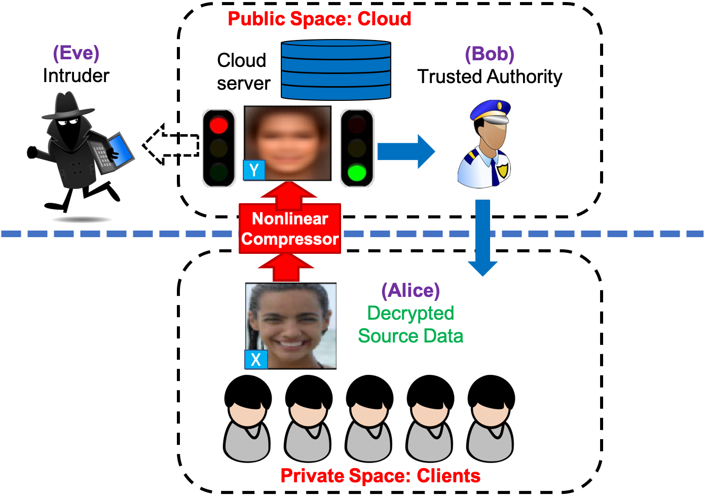
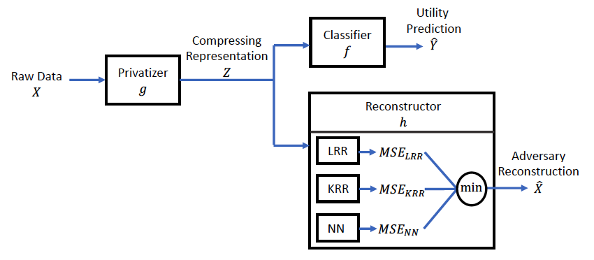

# Compressive Privacy Generative Adversarial Network
This is the repository includes all implementations and experimental settings which are elaborated in the published journal paper ["CPGAN"](https://ieeexplore.ieee.org/document/8963921). Actually, the authors only get familiar with Tensorflow as he was a master student, and that is why all scripts in this repository are limited to this deep learning framework.

## Abstract

Machine learning as a service (MLaaS) has brought much convenience to our daily lives recently. However, the fact that the service is provided through cloud raises privacy leakage issues. 
In this work we propose the compressive privacy generative adversarial network (CPGAN), a data-driven adversarial learning framework for generating compressing representations that retain utility comparable to state-of-the-art, with the additional feature of defending against reconstruction attack. This is achieved by applying adversarial learning scheme to the design of compression network (privatizer), whose utility/privacy performances are evaluated by the utility classifier and the adversary reconstructor, respectively. Experimental results demonstrate that CPGAN achieves better utility/privacy trade-off in comparison with the previous work, and is  applicable to real-world large datasets. 

## CPGAN's Intuition and Infrastructure

<center>  </center>

The CP architecture is elaborated above. Alice wishes to enjoy the image recognition service provided by Bob on the cloud, while concerning with the risk that her private image data might get exposed to malicious intruder (Eve) eavesdropping behind the cloud. To preserve privacy, Alice applies some privatization mechanism to her image before sending to the cloud, while Bob provides image recognition service based on the privatized image accessible on the cloud.


<center>  </center>

To solve the privacy issue mentioned above, we formulate the CPGAN architecture as above figure. More specifically, the compressing representation generated by the privatization mechanism is sent to the cloud to enjoy the utility service, while at the same time suffering the risk of falling into the hands of the adversary, by which reconstruction attack is performed. About the mathematical and theoretical formulation, please refer our published manuscript in IEEE transaction on information forensic.

## Multiple Adversaries Strategy

<center> </center>

Optimization of deep neural network is intractable, that is, it is questionable whether the neural network converges during training, or if it get stuck at a saddle point or local optimal instead of global optimal, which leads to an under-estimated adversary. To avoid our privatizer with the wear adversary, we thus propose the multiple adversaries to robustly evaluate the upper bound for the adversary regardless of optimization issues in neural network.

## Empirical Results 

All experiment proceeds under Tensorflow 1.6.0 and Python 3.6, we can not infer whether the latest version (e.g. 2.1.0) can run all this scripts. If not, we may re-implement this code using other frameworks. 

## Published Manuscript

- B. W. Tseng and P. Y. Wu, <br> *[Compressive Privacy Generative Adversarial Network](https://ieeexplore.ieee.org/document/8963921)*, <br> IEEE Transactions on Information Forensics and Security, 2020. 

- Please cite our work as follow:

```
@ARTICLE{8963921, 
	author={B. {Tseng} and P. {Wu}}, 
	journal={IEEE Transactions on Information Forensics and Security}, 
	title={Compressive Privacy Generative Adversarial Network}, 
	year={2020}, 
	volume={15}, 
	number={}, 
	pages={2499-2513},
}
```


## Authors

* **Bo-Wei Tseng** - GICE, NTU

* **Pei-Yuan Wu** - EE, NTU 


