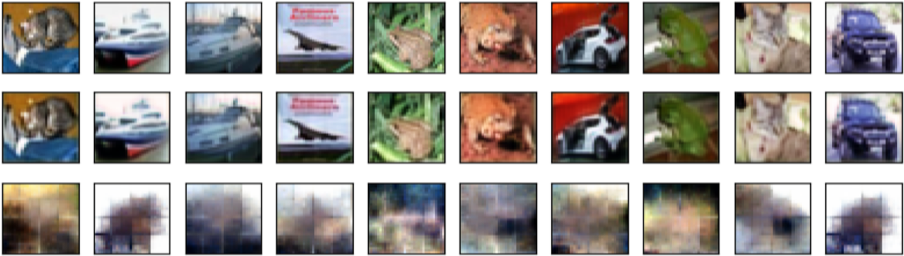

# CIFAR-10 Dataset

## Data Information

- Please refer to the [link](https://www.cs.toronto.edu/~kriz/cifar.html)
- To load this dataset, Tensorflow and Keras already provide all researchers  convenient way. For more information, please visit there official website. 

## Evaluation Metrics

- Adopt classification accuracy as sthe utility evaluation metric.
- Privacy is evaluated by qualitative results, that is, we evaluate the quality of the reconstructed images under human perception, as there is no fair comparison in the literature using the mean square loss.

## **Empirical Results**

- Reconstructions:

  <center> </center>	

  The first row of each figure consists of randomly sampled original images.  The second row consists of the reconstructed images assuming the adversary acquires the original image.  The last row consists of the images reconstructed from the compressing representations under white-box attack: 

- Utility Accuracy:

  | Model     | Accuracy |
  | ---       | ---      |
  | ResNet-20 | 92.28%   |
  | Zagoruyko | 96.2%    |
  | Xavier    | 96.45%   |
  | Zagoruyko | 93.87%   |

# Execution 

```
python main_cifar_cpgan.py --train True
```

The rest of the argument are not listed here, if you want to tune the parameters, please refer to the the file, which start with "main".