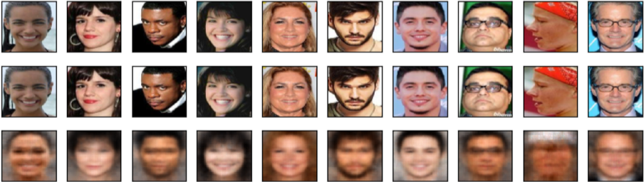

# CelebA Dataset

## CelebA Dataset Info.

- Please refer to the [link](http://mmlab.ie.cuhk.edu.hk/projects/CelebA.html)
- We already summarized the label information and saved it as the csv file (All_label.csv).
- Leverage facenet open source code to align and crop the facial images. Note that we upload it as the "understand facenet" folder, which includes all the instruction about how to use the original Facnet repository. 

## Evaluation Metrics

- Adopt classification accuracy as the utility evaluation metric.
- Privacy is evaluated by qualitative results, that is, we evaluate the quality of the reconstructed images under human perception, as there is no fair comparison in the literature using the mean square loss.

## Empirical Results

- Reconstructions:

   **Single task** 

  <center> </center>

   **Multi task** 

  

  <center> </center>

  The first row of each figure consists of randomly sampled original images.  The second row consists of the reconstructed images assuming the adversary acquires the original image.  The last row consists of the images reconstructed from the compressing representations under white-box attack.

- Utility Accuracy:

  **Single task**

  | Model     | Accuracy (%) |
  | :-:       | :-:      |
  | LNets+ANets | 87.30 |
  | Zhong | 89.97   |
  | CPGAN | 89.92   |

  **Multi task**

  | Model     | Accuracy (%) |
  | :-:       | :-:      |
  | Han | 92.52   |
  | ATNET_GT | 90.18    |
  | CPGAN   | 90.30   |


# Execution 

```
python main_multiple_celeba.py --train True --data_dir "Your Path" --label_dir "Your path"
```
```
python main_single_celeba.py --train True --data_dir "Your Path" --label_dir "Your path"
```

The rest of the argument are not listed here, if you want to tune the parameters, please refer to the the file, which start with "main".