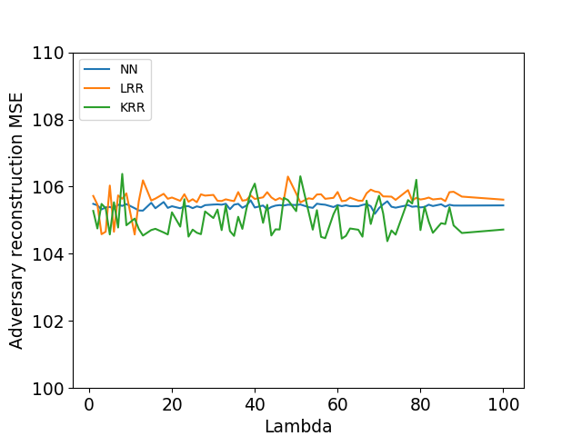

# GENKI-4K Dataset
## Data Information
- Consist of 4000 images, 2800 for training while 1200 for testing.
- Detect whether the facial image is smile or not.

## Experimental Detail

- Adopt classification accuracy as the utility evaluation metric.
- Privacy is evaluated by the adversaries (LRR, KRR, NN) 
achieving minimum mean square error.
## Empirical Results
- Trade-off between privacy and utility
<center>  </center>

- Reconstructed images from five privacy preserving methods.
<center>  </center>

- Neural networks not guarantee to attain minimum MSE.
<center>  </center>

## Excecution
```
bash compile.sh
```
Note that you can tune different parameters defined in the "main" file.
