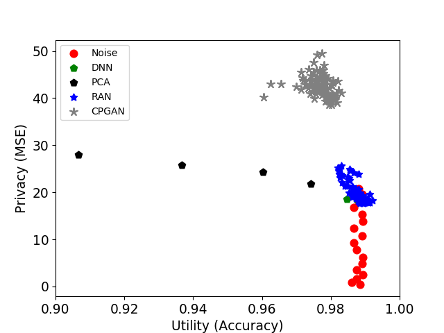

# MNIST Dataset
## MNIST Dataset Info.
- Pleaser refer to the [link](http://yann.lecun.com/exdb/mnist/)
- MNIST is well known for every deep learning researcher, so we will not take time to introduce it here.

## Evaluation Metrics
- Adopt classification accuracy as the utility evaluation metric.
- Privacy is evaluated by the reconstruction error between original and reconstructed images, and the adversary (LRR, KRR, NN) achieving the minimum MSE is chosen. Note that we use l2 norm here and it may have other alternative in the near future.

## Empirical Results
- Trade-off between privacy and utility
    <center>  </center>
We also provide the experimental records for these mechanisms, which are csv format file under the numberical-file folder. Each file records the MSE and accuracy with different trade-off parameters. Regarding to this paramters, please refer to our manuscript for more detail.

## Execution
```
python main_dnn.py --train True 
python main_hybrid.py --train True 
python main_ran.py --train True 
python main_noise.py --train True 
```
The rest of the argument are not listed here, if you want to try different parameters, please refer to our released code, in which the file name start with "main".
