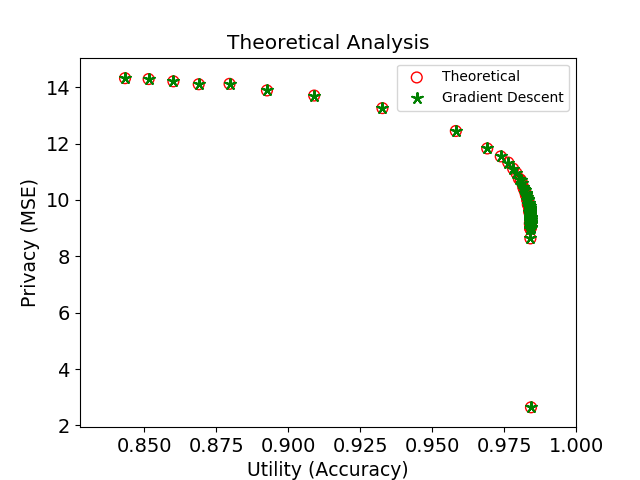

# Synthetic Dataset
## Data Information
- Sample 20k datae from two gaussian mixture model (for label 0/1) which has same covariance matrix.
- Guarantee our CPGAN trained by gradient descent achieves accuracy apporximate to theoretical results.

## Evaluation Metrics
- Adopt classification accuracy as the utility evaluation metric.
- Privacy is evaluated by the reconstruction error between original and reconstructed images, and the adversary (LRR, KRR, NN) achieving the minimum MSE is chosen. Note that we use l2 norm here and it may have other alternative in the near future.
- To attain theoretical optimum for both privacy and utility, some mathematical derivations are elaborated in our manuscript. 

## **Empirical Results**
- Trade-off between privacy and utility
    <center>  </center>
- Our CPGAN achieves the result, which is abe approximate to the theorectical optimum.
    <center>  </center>
## **Execution**
```
python main_gd.py --train True
python main_dnn.py --train True 
python main_hybrid.py --train True 
python main_ran.py --train True 
python main_noise.py --train True 
```
The rest of the argument are not listed here, if you want to try different parameters, please refer to our released code, in which the file name start with "main".

